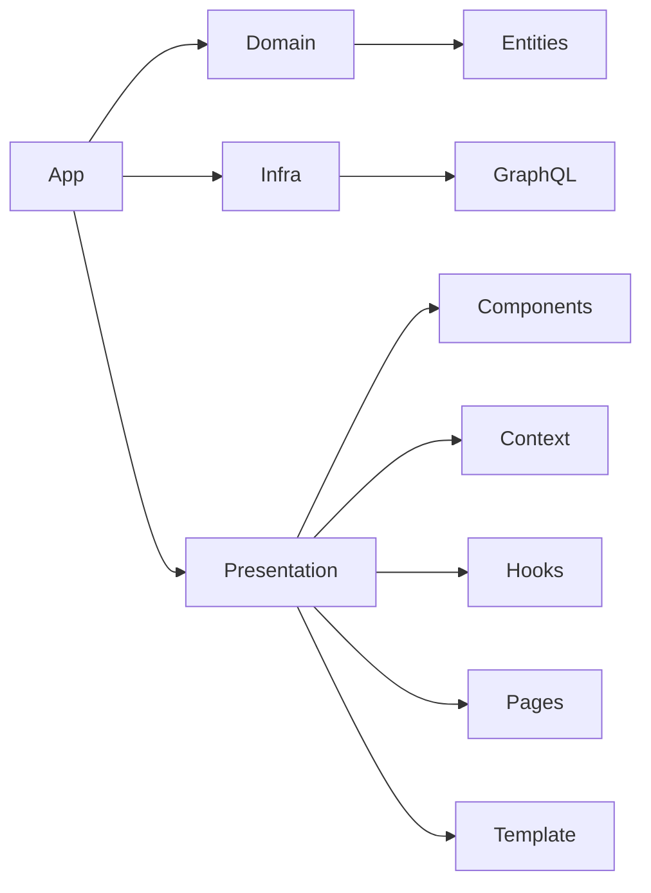

# Rick and Morty App

**React Native, Expo, GraphQL, Apollo Client**

App mobile desenvolvido com React Native e Expo, que realiza consultas a API GraphQL do Rick and Morty para exibir informações sobre personagens da série.

## Estrutura de Pastas

Este projeto segue um padrão de arquitetura baseado no Clean Architecture:

## Como executar

    npm install
    npm start
